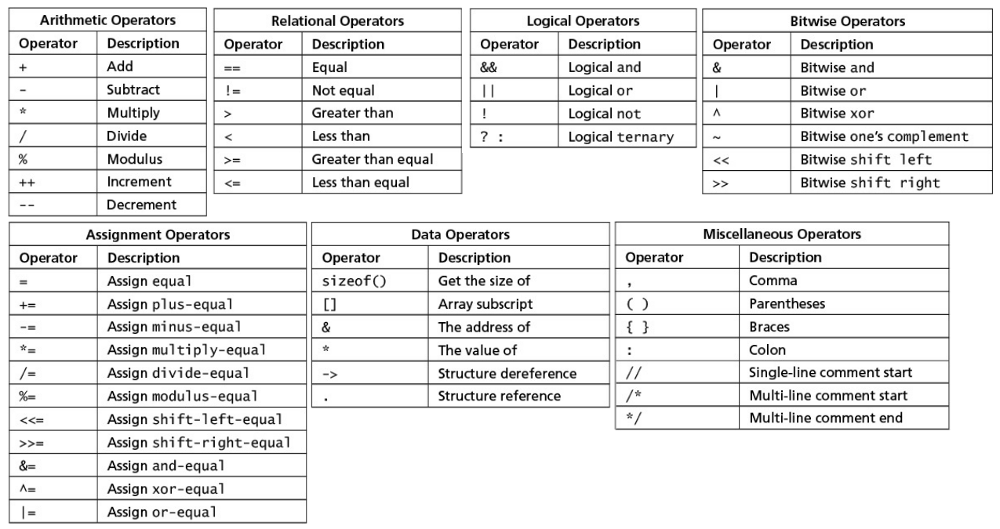

# Learn C the Hard Way
This repository inlcudes C codes that were used to follow and study the book's exercises.

<ins>Ex1: Simple **printf** function to print a statement to screen.</ins><br>
<ins>Ex2: Use of **Makefile**.</ins><br>
<ins>Ex3: **printf** with multiple variables and formatting.</ins><br>
<ins>Ex4: GDB cheat sheet</ins>
  - **run	[args]**	Start	your	program	with	[args].
  - **break	[file:]function**	Set	a	break	point	at	[file:]function.	You	can	also	use	**b**.
  - **backtrace**	Dump	a	backtrace	of	the	current	calling	stack.	Shorthand	is	**bt**.
  - **print	expr**	Print	the	value	of	expr.	Shorthand	is	**p**.
  - **continue**	Continue	running	the	program.	Shorthand	is	**c**.
  - **next**	Next	line,	but	step	over	function	calls.	Shorthand	is	**n**.
  - **step**	Next	line,	but	step	into	function	calls.	Shorthand	is	**s**.
  - **quit**	Exit	GDB.
  - **help**	List	the	types	of	commands.	You	can	then	get	help	on	the	class	of command	as	well	as	the	command.
  - **cd,	pwd,	make**	This	is	just	like	running	these	commands	in	your	shell.
  - **shell**	Quickly	start	a	shell	so	you	can	do	other	things.
  - **clear**	Clear	a	breakpoint.info	break,	info	watch	Show	information	about	breakpoints	and watchpoints.
  - **attach	pid**	Attach	to	a	running	process	so	you	can	debug	it.
  - **detach**	Detach	from	the	process.
  - **list**	List	out	the	next	ten	source	lines.	Add	a	-	to	list	the	previous	ten	lines.

<ins>Ex5: C Operators</ins>
<center></center>
<ins>Ex6: Basic Syntax</ins>

**if-statement**
```C
if(TEST) {
    CODE;
} else if(TEST) {
    CODE;
} else {
    CODE;
}
```
**switch-statement**
```C
switch (OPERAND) {
    case CONSTANT:
        CODE;
        break;
    default:
        CODE;
}
```
**while-loop**
```C
while(TEST) {
    if(OTHER_TEST) {
        continue;
    }
    else if (OTHER_TEST) {
        break;
    }
    CODE;
}
```
**do-while-loop**
```C
do {
    CODE;
} while(TEST);
```
**for-loop**
```C
for(INIT; TEST; POST) {
    CODE;
}
```
**enum (creates a set of integer constants)**
```C
enum { CONST1, CONST2, CONST3 } NAME;
```
**goto (jump to a label / useful for error detection)**
```C
if(ERROR_TEST) {
    goto fail;
}
fail:
    CODE;
```
**fuction**
```C
TYPE NAME(ARG1, ARG2, ..) {
    CODE;
    return VALUE;
}
```
**typedef (defines a new type)**
```C
typedef DEFINITION IDENTIFIER; //typedef unsigned char byte;
```
**struct (packaging of many base data types into a single concept)**
```C
struct NAME {
    ELEMENTS;
} [VARIABLE_NAME];
```
**union (similar to struct, but the elements will overlap in memory)**
```C
union NAME {
    ELEMENTS;
} [VARIABLE_NAME];
```
<ins>Ex07: **Variables** and **types**</ins><br>
<ins>Ex08: **If-Else if-Else**</ins><br>
